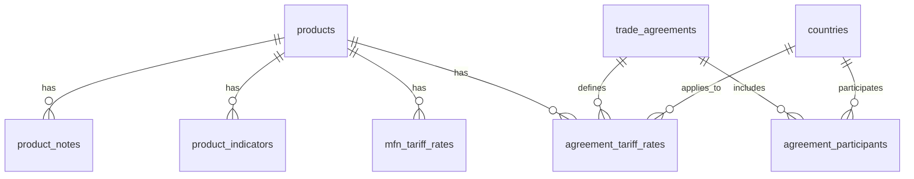

# 📊 Normalized Tariff Database Schema Guide

## 🎯 Overview

This document explains how the original `tariff_data_2025` CSV has been split into **8 normalized tables** for easier reference, better performance, and improved data integrity.

## 📋 Original Data Structure

The original CSV contained **130+ columns** with highly denormalized data:
- Product information (HTS codes, descriptions)
- MFN tariff rates
- Country-specific rates for 20+ trade agreements
- Special indicators (GSP, Pharmaceutical, etc.)
- Notes and comments

## 🗂️ New Normalized Structure

### **1. `products` Table**
**Purpose**: Core product information
```sql
- id (Primary Key)
- hts8 (8-digit HTS code)
- brief_description
- quantity_1_code, quantity_2_code
- wto_binding_code
- created_at, updated_at
```

**Source**: `hts8`, `brief_description`, `quantity_1_code`, `quantity_2_code`, `wto_binding_code`

---

### **2. `countries` Table**
**Purpose**: Reference table for all countries/regions
```sql
- id (Primary Key)
- country_code (3-letter ISO code)
- country_name, country_name_short
- region, continent, currency
- created_at, updated_at
```

**Source**: Extracted from trade agreement columns (CA, MX, AU, etc.)

---

### **3. `trade_agreements` Table**
**Purpose**: Trade agreements metadata
```sql
- id (Primary Key)
- agreement_code (GSP, NAFTA_CA, etc.)
- agreement_name
- agreement_type (FTA, PTA, PREFERENCE)
- is_multilateral
- effective_date, expiration_date
- created_at, updated_at
```

**Source**: Column prefixes (`gsp_`, `nafta_`, `chile_`, etc.)

---

### **4. `agreement_participants` Table**
**Purpose**: Countries participating in trade agreements
```sql
- id (Primary Key)
- agreement_id (FK to trade_agreements)
- country_id (FK to countries)
- participant_type (PARTNER, EXCLUDED)
- created_at
```

**Source**: Trade agreement indicators and country mappings

---

### **5. `mfn_tariff_rates` Table**
**Purpose**: Most Favored Nation tariff rates
```sql
- id (Primary Key)
- product_id (FK to products)
- mfn_text_rate, mfn_rate_type_code
- mfn_ave, mfn_ad_val_rate, mfn_specific_rate, mfn_other_rate
- col1_special_text, col1_special_mod
- col2_text_rate, col2_rate_type_code, col2_ad_val_rate, col2_specific_rate, col2_other_rate
- begin_effect_date, end_effective_date
- created_at, updated_at
```

**Source**: `mfn_*` and `col2_*` columns

---

### **6. `agreement_tariff_rates` Table**
**Purpose**: Country-specific rates under trade agreements
```sql
- id (Primary Key)
- product_id (FK to products)
- agreement_id (FK to trade_agreements)
- country_id (FK to countries)
- rate_type_code, ad_val_rate, specific_rate, other_rate
- effective_date, expiration_date
- created_at, updated_at
```

**Source**: All country-specific rate columns (`mexico_*`, `chile_*`, `korea_*`, etc.)

---

### **7. `product_indicators` Table**
**Purpose**: Special indicators for products
```sql
- id (Primary Key)
- product_id (FK to products)
- indicator_type (GSP, PHARMACEUTICAL, DYES, etc.)
- indicator_value (Y, N, or specific value)
- excluded_countries (for GSP exclusions)
- effective_date, expiration_date
- created_at, updated_at
```

**Source**: `gsp_indicator`, `pharmaceutical_ind`, `dyes_indicator`, etc.

---

### **8. `product_notes` Table**
**Purpose**: Additional notes and comments
```sql
- id (Primary Key)
- product_id (FK to products)
- note_type (FOOTNOTE, ADDITIONAL_DUTY)
- note_content
- effective_date, expiration_date
- created_at, updated_at
```

**Source**: `footnote_comment`, `additional_duty`

## 🔗 Table Relationships



## 📊 Data Mapping Examples

### **Example 1: Product with MFN Rate**
**Original CSV Row**:
```csv
hts8,brief_description,mfn_text_rate,mfn_ad_val_rate
"01012100","Live purebred breeding horses","Free",0
```

**Normalized Tables**:
```sql
-- products table
INSERT INTO products (hts8, brief_description) 
VALUES ('01012100', 'Live purebred breeding horses');

-- mfn_tariff_rates table
INSERT INTO mfn_tariff_rates (product_id, mfn_text_rate, mfn_ad_val_rate)
VALUES (1, 'Free', 0);
```

### **Example 2: Product with Trade Agreement Rates**
**Original CSV Row**:
```csv
hts8,mexico_indicator,mexico_ad_val_rate,chile_indicator,chile_ad_val_rate
"01013000","MX",0,"CL",0
```

**Normalized Tables**:
```sql
-- agreement_tariff_rates table (multiple rows)
INSERT INTO agreement_tariff_rates (product_id, agreement_id, country_id, ad_val_rate)
VALUES 
    (1, (SELECT id FROM trade_agreements WHERE agreement_code = 'NAFTA_MX'), 
         (SELECT id FROM countries WHERE country_code = 'MX'), 0),
    (1, (SELECT id FROM trade_agreements WHERE agreement_code = 'CHILE_FTA'), 
         (SELECT id FROM countries WHERE country_code = 'CL'), 0);
```

## 🚀 Benefits of Normalization

### **1. Easier Reference**
- **Before**: 130+ columns in one table
- **After**: 8 focused tables with clear purposes

### **2. Better Performance**
- **Indexes**: Optimized for common queries
- **JOINs**: Only when needed
- **Storage**: Reduced redundancy

### **3. Data Integrity**
- **Foreign Keys**: Enforce relationships
- **Constraints**: Prevent invalid data
- **Normalization**: Eliminate anomalies

### **4. Flexibility**
- **New Agreements**: Easy to add
- **New Countries**: Simple to include
- **Rate Changes**: Historical tracking

## 🔍 Common Query Patterns

### **1. Get All Rates for a Product**
```sql
SELECT 
    p.hts8,
    p.brief_description,
    mfn.mfn_ad_val_rate as mfn_rate,
    agr.ad_val_rate as agreement_rate,
    ta.agreement_name,
    c.country_name
FROM products p
LEFT JOIN mfn_tariff_rates mfn ON p.id = mfn.product_id
LEFT JOIN agreement_tariff_rates agr ON p.id = agr.product_id
LEFT JOIN trade_agreements ta ON agr.agreement_id = ta.id
LEFT JOIN countries c ON agr.country_id = c.id
WHERE p.hts8 = '01012100';
```

### **2. Find Products with GSP Benefits**
```sql
SELECT 
    p.hts8,
    p.brief_description,
    pi.indicator_value as gsp_status
FROM products p
JOIN product_indicators pi ON p.id = pi.product_id
WHERE pi.indicator_type = 'GSP'
AND pi.indicator_value = 'Y';
```

### **3. Compare MFN vs Agreement Rates**
```sql
SELECT 
    p.hts8,
    p.brief_description,
    mfn.mfn_ad_val_rate as mfn_rate,
    agr.ad_val_rate as agreement_rate,
    (mfn.mfn_ad_val_rate - agr.ad_val_rate) as savings
FROM products p
JOIN mfn_tariff_rates mfn ON p.id = mfn.product_id
JOIN agreement_tariff_rates agr ON p.id = agr.product_id
WHERE agr.agreement_id = (SELECT id FROM trade_agreements WHERE agreement_code = 'CHILE_FTA')
AND mfn.mfn_ad_val_rate > agr.ad_val_rate;
```

## 📈 Migration Statistics

After running the migration script, you should see:
- **~13,032 products** loaded
- **17 countries** loaded
- **26 trade agreements** loaded
- **~13,032 MFN rates** loaded
- **~50,000+ agreement rates** loaded
- **~5,000+ product indicators** loaded
- **~1,000+ product notes** loaded

## 🛠️ Usage Instructions

### **1. Run Schema Creation**
```bash
psql -U postgres -d tariff -f backend/src/main/resources/database/V1__Create_tariffs_raw_table.sql
psql -U postgres -d tariff -f backend/src/main/resources/database/V2__Create_users_table.sql
psql -U postgres -d tariff -f backend/src/main/resources/database/V3__Create_tariff_schema.sql
psql -U postgres -d tariff -f backend/src/main/resources/database/V4__Create_calculations_table.sql
```

### **2. Run Data Migration**
```bash
psql -U postgres -d tariff -f backend/src/main/resources/database/V5__Populate_normalized_tables.sql
```

### **3. Verify Data**
```sql
-- Check record counts
SELECT 'products' as table_name, COUNT(*) as count FROM tariff.products
UNION ALL
SELECT 'countries', COUNT(*) FROM tariff.countries
UNION ALL
SELECT 'trade_agreements', COUNT(*) FROM tariff.trade_agreements
UNION ALL
SELECT 'mfn_tariff_rates', COUNT(*) FROM tariff.mfn_tariff_rates
UNION ALL
SELECT 'agreement_tariff_rates', COUNT(*) FROM tariff.agreement_tariff_rates;
```

## 🎯 Next Steps

1. **Update Backend Models**: Modify JPA entities to match new schema
2. **Update Services**: Modify queries to use normalized tables
3. **Update Frontend**: Adjust API calls for new data structure
4. **Add Indexes**: Optimize for your specific query patterns
5. **Add Constraints**: Enforce business rules

## 📚 Additional Resources

- **Database Schema**: `V1__Create__tariff_schema.sql`
- **Migration Script**: `V2__Populate__traiff_schema.sql`
- **Original CSV**: `tariff_data_2025/tariff_database_2025_utf8.csv`

